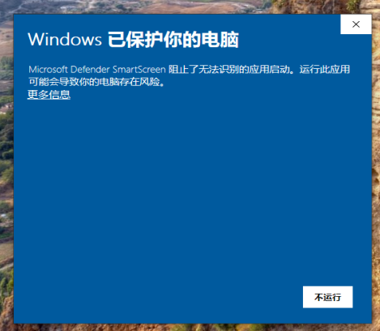
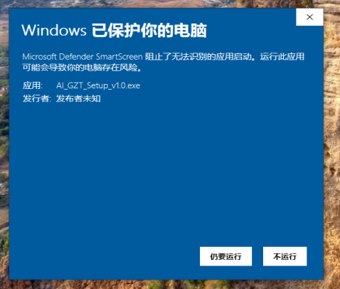
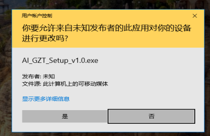
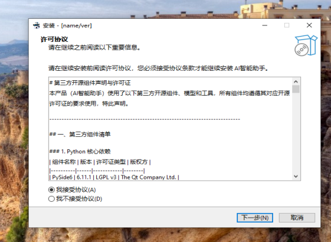
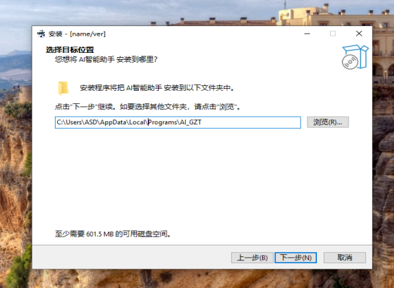
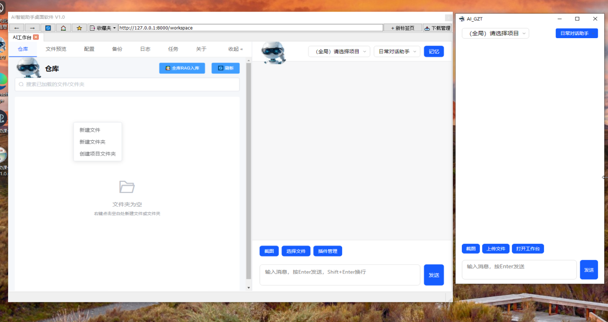
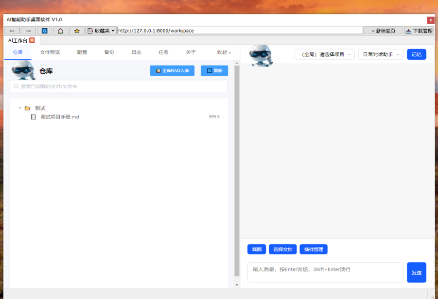
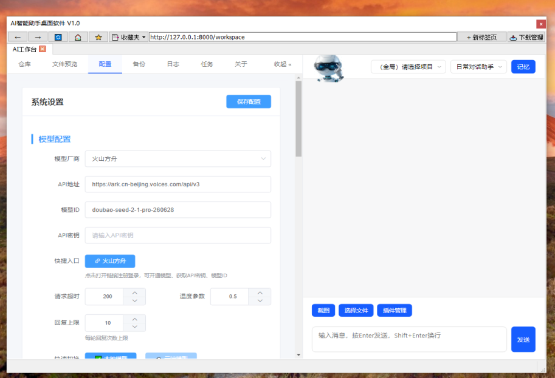
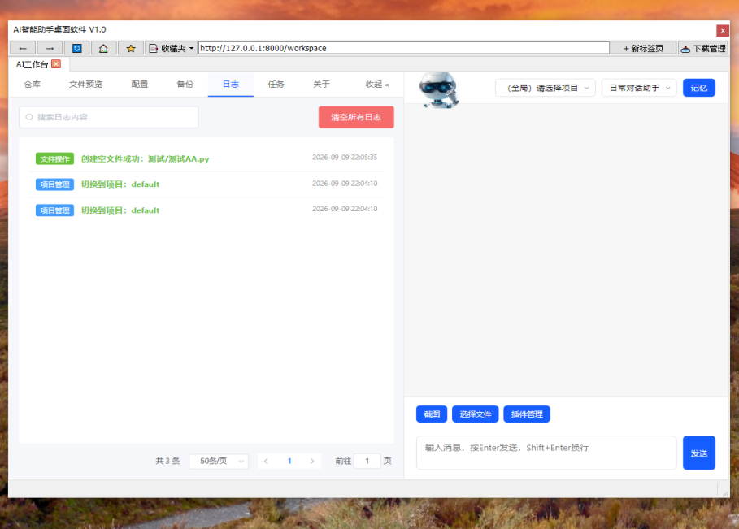
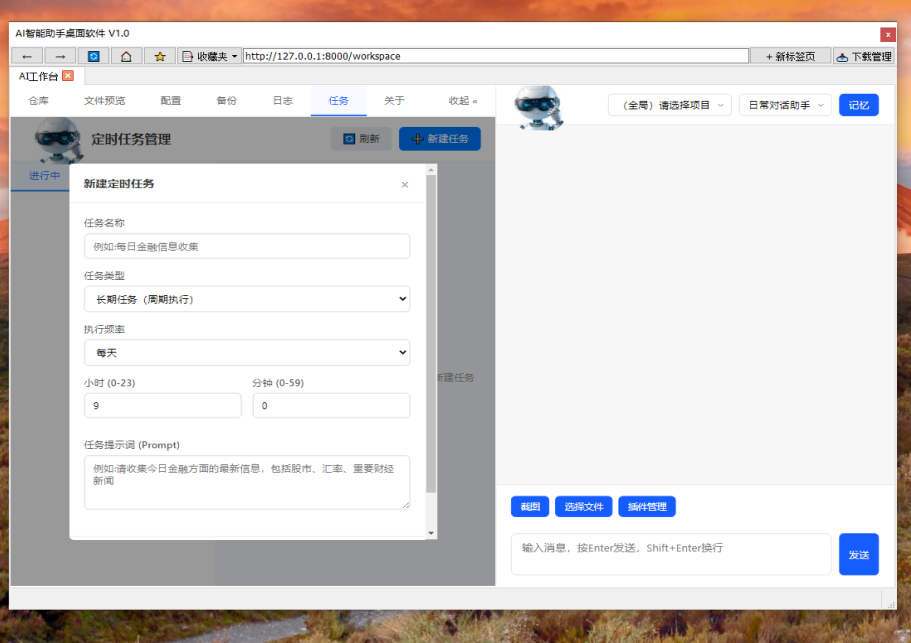

# AI智能助手

> 本地优先、可审计的 Windows 桌面 AI 工作台。基于大语言模型实现自然语言交互，支持本地模型离线部署，内置 RAG 私有知识库与向量记忆，采用插件化扩展架构，所有数据默认本地存储，可以根据需求自行在设置页面更换云端模型，修改后即刻生效。默认使用多模态的模型，非多模态模型使用截图和发送图片给AI会报错。

## 项目背景:一个"守门员"和 AI 吵出来的软件

这个项目诞生于 2025 年的一次普通聊天——一位**完全没有代码基础的 70 后"守门员"**，在和 AI 闲聊时冒出一个念头:能不能让 AI 给自己做一个专属的 AI 工作台？

说干就干。最开始用的是免费的 AI 对话，一个不行就换一个；后来把云端模型的 API 接进工作台，让 AI **边写、边改、边测试**。这一路堪称"人机拉锯战":方案多次推翻重来，和 AI "吵架"更是家常便饭——直到 2025 年末，软件才慢慢稳定下来，进入缓慢修补阶段；作者也耳濡目染，学会了一点皮毛（真的不多）。

必须说明的是，这个工作台的代码 **100% 由 AI 亲手"搓"出来**:豆包、通义千问、文心一言……多位 AI 轮番上阵，人类负责提需求和"拍砖"。

零基础也完全玩得转:下载启动后，把源码丢进工作台的仓库，就能继续让 AI 按你的需求做个性化开发。界面简单直接，是一款**适合无基础个人玩家**的 AI 编程工具。

> 🥅 温馨提示:零基础也能上手——当然，和 AI 反复"吵架"返工的过程无法避免，欢迎亲自体验。

## 仓库地址

- **Gitee 国内镜像**（推荐国内用户使用，克隆与下载速度更快）:<https://gitee.com/chen-bohan3000/ai-gzt>

---

## 下载安装

| 文件                      | 说明                                                                                             | 下载链接                                                               |
| ----------------------- | ---------------------------------------------------------------------------------------------- | ------------------------------------------------------------------ |
| AI智能助手 v1.0 Windows 安装包 | 安装包（约 199 MB），已内置 Python 运行环境与全部依赖，安装后开箱即用                                                     | [123 云盘下载](https://4004388641.share.123pan.cn/123pan/NFTTwh-bBDxv) |
| Python 环境一键安装脚本         | `Python和依赖安装.bat`，完整依赖安装，大约需要3G的C盘空间。*安装完整依赖才可以使用RAG 知识库和向量记忆召回功能，没有安装完整依赖可以在设置中把上下文轮数的参数适当调高* | [123 云盘下载](https://4004388641.share.123pan.cn/123pan/NFTTwh-hLR4v) |

> 📥 123 云盘链接免登录、免费用户下载不限速，浏览器打开即可下载，无需安装客户端。
> ⚠️ 下载 `.bat` 脚本时如浏览器提示"此文件可能损害你的设备"，在浏览器下载记录中选择「保留」即可（该脚本为开源一键环境安装脚本，源码见仓库根目录 `Python和依赖安装.bat`）。
> 🔒 安装包首次运行如遇 Windows SmartScreen 蓝色提示窗，按下方「未签名安装包如何跳过 SmartScreen」章节的 4 步操作即可。

---

## 未签名安装包如何跳过 SmartScreen（安装包用户必读）

官方安装包未经代码签名，首次双击安装时 Windows 可能弹出安全提示，这是所有未签名软件的正常现象，**不代表软件有风险**。按以下 4 步操作即可顺利安装（前 3 个弹窗仅首次安装未签名版时出现）:

**第 1 步:SmartScreen 蓝色提示窗 —— 点击「更多信息」**



在弹出的蓝色窗口「Windows 已保护你的电脑」中，点击提示文字下方的 **「更多信息」**。

**第 2 步:点击「仍要运行」**



窗口展开后会显示应用名称与发布者信息，点击随即出现的 **「仍要运行」** 按钮，安装程序开始启动。

**第 3 步:用户帐户控制（UAC）黄色弹窗 —— 点击「是」**



随后弹出黄色的「用户帐户控制」窗口，询问"你要允许来自未知发布者的应用对你的设备进行更改吗？"，发布者显示为"未知"是未签名所致，属正常现象。点击 **「是」** 进入安装向导。

**第 4 步:全中文安装向导内完成安装**



- 许可协议页:勾选 **「我接受协议」**，点击「下一步」



- 选择目标位置页:确认安装路径（默认安装到当前用户目录），点击「下一步」→「安装」，等待进度条走完即安装完成

> 💡 提示:以上 SmartScreen 与 UAC 提示仅在首次安装未签名版本时出现，安装完成后从桌面/开始菜单启动程序不会再弹出。

## 开源与版本说明

本软件源码 **100% 免费开源**（Apache 2.0 协议），功能无任何阉割，自行下载源码即可运行全部能力。

除上方 123 云盘的 `.exe` 安装包外，另提供 **ZIP 绿色免安装版**（解压即用、不写注册表，与使用说明书中的命名一致）。如有需要，可通过以下方式获取:

- 邮箱联系作者:**602477958@qq.com**（来信请注明"AI智能助手 ZIP 免安装版"，通常 1~2 个工作日内回复）
- 使用问题与功能建议，欢迎在 [Gitee 仓库 Issue](https://gitee.com/chen-bohan3000/ai-gzt/issues) 公开反馈，便于其他用户参考

---

## 核心特性

- **本地隐私优先**:对话记忆、RAG 知识库、配置文件全部存储在本地，代码开源可审计
- **插件化架构**:标准化工具调用协议，支持图片生成、视频生成、网页采集、文件格式转换、进程监控、企业微信通道等插件，社区可自由扩展
- **RAG 私有知识库**:内置向量检索（faiss + gte-small-zh 中文模型），支持代码库索引与记忆召回，依赖缺失时自动优雅降级 
- **桌面工作台**:PySide6 桌面端 + Web 管理界面，内置浏览器、文件仓库、定时任务、备份管理、操作日志
- **工程化打包**:PyInstaller + Inno Setup 一键打包，frozen 环境下自动探测外部 Python 依赖注入

## 界面预览

**工作台 + 悬浮窗双模式自由切换**:全屏工作台深度操作，迷你悬浮窗随时唤起对话，文件仓库支持右键快捷菜单。



**文件仓库**:项目文件集中管理，支持上传、分类、在线预览与代码编辑，所有数据保存在本地。



**系统设置 · 模型配置**:可视化配置云端模型 API 或本地模型，参数修改保存后即刻生效，无需重启。



**操作日志**:AI 的每一步文件操作、命令执行都完整留痕，做了什么、改了哪里一目了然，可审计、可回溯。



**定时任务**:可视化新建定时任务，支持 Cron 表达式，让 AI 按时自动执行脚本、采集信息或备份文件。



## 开源许可证

本项目基于 **Apache License 2.0** 开源，完整许可证文本见 [LICENSE](LICENSE)。

Copyright 2026 AI智能助手开发团队

Licensed under the Apache License, Version 2.0 (the "License"); you may not use this file except in compliance with the License. You may obtain a copy of the License at http://www.apache.org/licenses/LICENSE-2.0

Unless required by applicable law or agreed to in writing, software distributed under the License is distributed on an "AS IS" BASIS, WITHOUT WARRANTIES OR CONDITIONS OF ANY KIND, either express or implied.

二次分发时须保留版权声明与 LICENSE 文件；修改过的文件须注明变更。

## ⚠️ 安全与权限声明

本工具为**高权限本地效率工具**，以下能力由 AI 按自然语言指令驱动，请在可信目录、充分理解指令含义的前提下使用:

- **终端命令执行**:可执行任意系统命令
- **文件读写/编辑/删除**:可操作仓库目录内文件（系统目录默认在禁止列表）
- **进程监控与终止**:可扫描并结束运行中的进程（内置系统关键进程保护名单）
- **全局截图**:可截取屏幕任意区域
- **网页采集**:可访问公网网页并提取内容
- **企业微信通道**:启用后可远程接收指令

建议:不要在包含敏感数据的目录中授予仓库权限；插件密钥仅保存在本地配置中。

## 第三方服务与数据隐私

- 云端大模型（如火山方舟/豆包）、图片/视频生成插件:**API Key 由用户自行申请并在设置页配置**，请求直接从本机发往服务商，本项目不中转、不收集任何数据
- 对象存储（火山引擎 TOS）:仅在用户主动配置 AK/SK 后用于文件上传，默认关闭
- 本地模型与向量检索:完全离线运行，无任何网络请求
- 第三方开源组件许可证清单见 [THIRD_PARTY_LICENSES.md](THIRD_PARTY_LICENSES.md)

## 快速开始

> 📦 **请先确认你拿到的是哪种分发形式:**
>
> - **安装包用户（`.exe` 安装包）**:运行环境（Python 与全部依赖）已内置打包，**安装后开箱即用，无需运行本章节任何命令、无需下载 `Python和依赖安装.bat`**。
>
> - **源码包用户（`git clone` 或下载 Release 页的 Source code 压缩包）**:本机需先配置 Python 3.11 运行环境。**推荐直接双击项目根目录下的 `Python和依赖安装.bat` 一键自动安装**（见下方方式一）；本机已有 Python 3.11 环境的用户也可按方式二手动安装依赖。
>
>   国内用户推荐从 **Gitee 镜像**克隆（速度更快）:
>
>   ```bash
>   git clone https://gitee.com/chen-bohan3000/ai-gzt.git
>   ```

**方式一:一键环境安装（推荐，无需手动装任何东西）**

Windows 用户直接双击项目根目录下的 **`Python和依赖安装.bat`**，脚本会自动完成全部环境准备。尚未克隆仓库、手头没有该脚本的用户，可在上方「下载安装」板块通过 123 云盘链接单独下载（安装包用户无需下载）:

1. 检测并自动下载安装 **Python 3.11.9**（华为云镜像，静默安装到当前用户目录，**无需管理员权限**）
2. 检测并自动安装 **VC++ 2015-2022 x64 运行库**（PyTorch 等依赖必需，已安装则自动跳过）
3. 自动升级 pip 并配置清华国内镜像源，加速依赖下载
4. 自动安装 `requirements.txt` 中的全部依赖（总大小约 3.5 GB，预计 5-15 分钟，请耐心等待）
5. 自动校验 PySide6、FastAPI、PyTorch、Transformers 等核心依赖是否安装成功

看到「环境配置全部完成」提示后，直接运行 `python main.py` 启动程序即可。若中途报错，按脚本窗口内的中文提示排查网络后重新运行即可（已安装的步骤会自动跳过）。

**方式二:手动安装（本机已有 Python 3.11 环境的用户）**

```bash
# 环境要求:Python 3.11（向量检索依赖需 3.11）
pip install -r requirements.txt
python main.py
```

首次启动后在「系统设置」中配置模型 API（或选择本地模型），设置仓库目录即可使用。完整打包方案见 `build.py` 。

## 源码运行补充:向量模型文件

RAG 私有知识库依赖中文向量模型 `gte-small-zh`（阿里达摩院 GTE 中文向量模型，向量维度 512）。

- **安装版用户无需任何操作**:安装包已内置完整模型文件（`pytorch_model.bin`，约 58 MB），开箱即用。
- **源码用户请注意**:受 GitHub 仓库体积限制，模型权重文件 `pytorch_model.bin` 未纳入 Git 仓库。`git clone` 后需自行下载该文件并放入 `gte-small-zh/` 目录；若缺少该文件，程序启动时 RAG 知识库会**自动降级禁用**（对话、插件等其他功能完全不受影响），控制台会打印警告信息。

**下载方式一:网页直接下载（推荐）**

1. 打开 ModelScope 模型主页:https://modelscope.cn/models/iic/nlp_gte_sentence-embedding_chinese-small
2. 切换到「文件」标签页，在文件列表中找到 `pytorch_model.bin`，点击下载
3. 将下载得到的 `pytorch_model.bin` 放入项目根目录下的 `gte-small-zh/` 文件夹，与 `configuration.json`、`vocab.txt` 等文件同级

**下载方式二:modelscope 命令行**

```bash
pip install modelscope
modelscope download --model iic/nlp_gte_sentence-embedding_chinese-small pytorch_model.bin --local_dir gte-small-zh
```

放置完成后，`gte-small-zh/` 目录结构应如下所示:

```
gte-small-zh/
├── pytorch_model.bin        # ← 需自行下载（约 58 MB）
├── configuration.json
├── config.json
├── vocab.txt
├── tokenizer_config.json
├── special_tokens_map.json
└── ...
```

## 插件开发

插件放置于 `plugins/` 目录，每个插件包含 `main.py` + `plugin.json`，模板参考 `plugin_templates/` 目录下的三类标准模板（AIGC 生成类 / 信息采集查询类 / 本地操作类）。

## 免责声明

本软件按"现状"提供，作者不对使用本工具造成的任何直接或间接损失承担责任。请遵守当地法律法规，勿将本工具用于任何违法用途。
